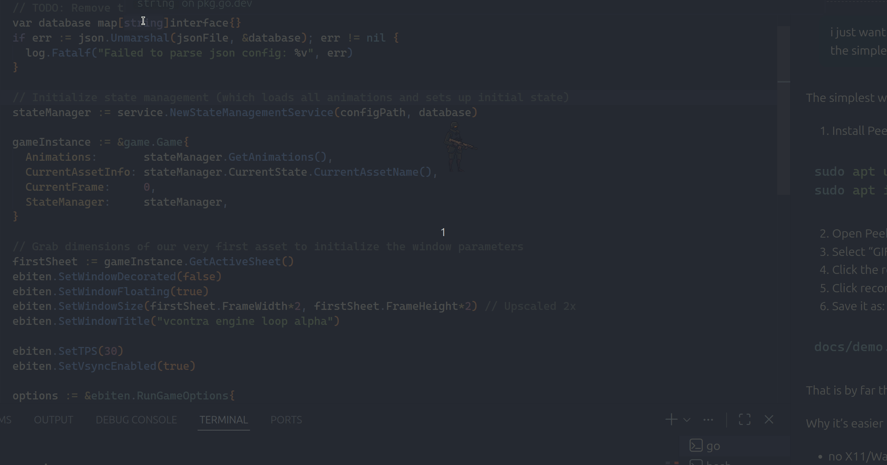

# vcontra

A lightweight sprite-based animation prototype built with Go and Ebiten. The project loads sprite sheets from the asset config, tracks state transitions by soldier, and renders looping animation frames with a transparent windowed setup.

## Demo



## Features

- Sprite sheet loading from JSON metadata
- Stateful animation transitions for multiple soldiers
- Moving, idle, and transition asset grouping by soldier number
- Transparent window rendering
- Mouse drag support for moving the floating window
- Simple asset-driven game loop

## Tech stack

- Go
- Ebiten v2
- JSON asset configuration

## Project structure

```text
.
├── main.go
├── go.mod
├── LICENSE
├── README.md
├── internal/
│   ├── animation/
│   │   └── engine.go
│   ├── game/
│   │   └── gamesetup.go
│   ├── models/
│   │   └── assetstate.go
│   └── service/
│       └── statemanagement.go
└── res/
    └── assets/
        ├── assetConfig.json
        └── Soldier_1/
```

## Prerequisites

- Go 1.25 or newer
- Linux/macOS/Windows supported by Ebiten
- A working display environment for the windowed game loop

## Run the project

From the repository root:

```bash
go run main.go
```

To do a compile check:

```bash
go build ./...
```

## Controls

- Left mouse drag: move the floating window
- The app continuously cycles through state-based sprite animations defined in `res/assets/assetConfig.json`

## Asset configuration

The asset metadata file at `res/assets/assetConfig.json` defines each sprite sheet with:

- `total_frames`
- `state_kind`
- `soldier_number`

This is used to group animation assets by soldier and state.

## State model

The current implementation supports:

- `IDLE`
- `MOVING`
- `TRANSITION`

The state management service selects the next animation based on the current soldier and state kind.

## Notes

This project is a prototype/engine playground and is intentionally simple. It is ideal for experimenting with sprite-driven animation systems and state transitions before extending it into a larger game.

## License

This project is licensed under the terms in the `LICENSE` file.
